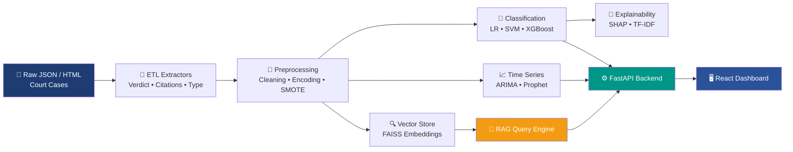
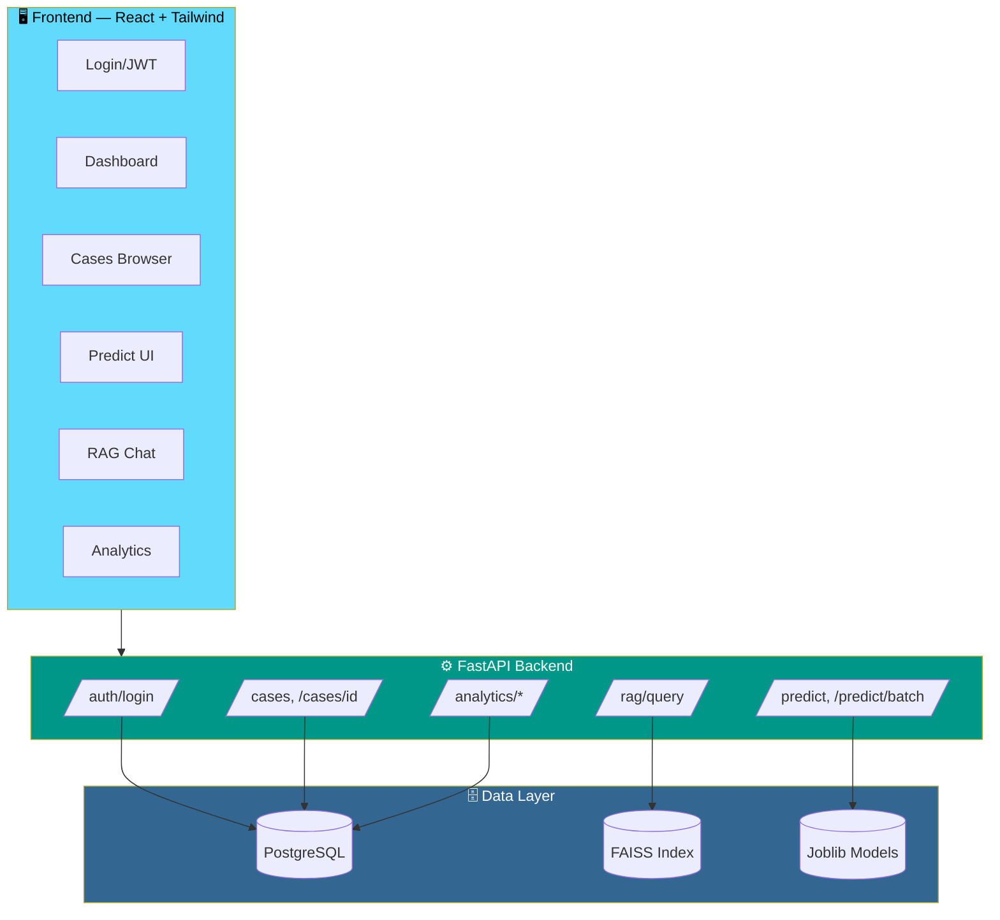

<div align="center">

<a href="https://github.com">
  
</a>
<br/>
<p>
  
  
  
  
  
</p>
<p>
  
  
  
  
  
</p>
</div>

<br/>


## 📚 Table of Contents

<div align="center">

| 🚀 Overview | 🏗️ Architecture | ✨ Features | 📁 Structure |
|:---:|:---:|:---:|:---:|
| [Overview](#overview) | [Architecture](#architecture) | [Features](#features) | [Structure](#project-structure) |

| ⚡ Quick Start | 🔌 API Reference | 📊 Results | 🐳 Docker |
|:---:|:---:|:---:|:---:|
| [Quick Start](#quick-start) | [API Reference](#api-reference) | [Results](#key-results) | [Docker](#docker-full-stack) |

| 🧪 Testing | 🗄️ Migrations | 🤝 Contributing | 📄 License |
|:---:|:---:|:---:|:---:|
| [Testing](#testing) | [Migrations](#database-migrations) | [Contributing](#contributing) | [License](#license) |

</div>

---

## 🚀 Overview

**Legal NLP Platform** is a production-grade, end-to-end system that turns raw historical court case data (HTML/JSON) into a fully queryable legal intelligence platform—combining rule-based ETL, multi-model classification, time-series forecasting, and retrieval-augmented generation (RAG), all served through a FastAPI backend and a React dashboard.

> Built for teams building **legal AI assistants**, case-outcome research tools, or judicial analytics products.




## 🏗️ Architecture
 


---

## ✨ Features

<table>
<tr>
<td width="50%" valign="top">

<h3>🔧 Data Pipeline</h3>

<ul>
<li><strong>ETL</strong>: JSON → structured DataFrame (verdict, case type, sub-type, citations)</li>
<li><strong>Checkpointing</strong>: resumable pipeline runs</li>
<li><strong>Class mapping</strong>: 5 case types, 5 verdict classes</li>
<li>Rule-based extractors, fully tested</li>
</ul>

</td>

<td width="50%" valign="top">

<h3>🤖 Machine Learning</h3>

<ul>
<li><strong>3 targets × 3 models</strong>: Logistic Regression, Linear SVM, XGBoost</li>
<li><strong>Imbalance handling</strong>: SMOTE + <code>class_weight='balanced'</code></li>
<li><strong>Explainability</strong>: SHAP + TF-IDF importance</li>
<li>Model comparison reports per target</li>
</ul>

</td>
</tr>

<tr>
<td width="50%" valign="top">

<h3>🔍 Semantic Search (RAG)</h3>

<ul>
<li><strong>FAISS</strong> vectorstore over case text</li>
<li>LLM-powered query engine</li>
<li>3,487 indexed chunks</li>
<li><code>/rag/query</code> endpoint for natural-language Q&amp;A</li>
</ul>

</td>

<td width="50%" valign="top">

<h3>📈 Analytics &amp; Forecasting</h3>

<ul>
<li>Yearly trend analysis</li>
<li><strong>ARIMA / Prophet</strong> forecasting</li>
<li>Interactive dashboard charts</li>
<li>Confusion matrices + radar comparisons</li>
</ul>

</td>
</tr>
</table>

<details>
<summary><b>🖥️ Frontend pages (click to expand)</b></summary>

<br>

| Page | Description |
|------|-------------|
| `Login.jsx` | JWT-based authentication |
| `Dashboard.jsx` | Overview stats + charts |
| `Cases.jsx` | Browseable + filterable case list |
| `CaseDetail.jsx` | Full case detail + similar cases |
| `Predict.jsx` | Single + batch prediction UI |
| `RAG.jsx` | Chat-style RAG query interface |
| `Analytics.jsx` | Distributions, trends, forecast |
| `ModelReports.jsx` | Model comparison + radar charts |

</details>

---
 
## 📁 Project Structure

<details open>
<summary><b>Click to collapse/expand full tree</b></summary>

```text
legal_nlp/
├── main.py                    # Data science pipeline orchestrator
├── config.py                  # All paths, constants, hyperparameters
├── requirements.txt
├── alembic.ini                # Database migration config
├── docker-compose.yml         # Full-stack Docker orchestration
├── Dockerfile.api             # Backend Docker image
├── .env.example               # Environment variable template
│
├── extractors/                # Rule-based ETL extractors
├── preprocessing/             # Feature encoding, cleaning, splitting
├── modeling/                  # LR / SVM / XGBoost classifiers
├── pipeline/                  # ETL orchestration + checkpoints
├── evaluation/                # Metrics, class balance, RAG eval
├── visualization/             # EDA, confusion matrix, SHAP plots
├── time_series/               # ARIMA forecasting + trend analysis
├── explainability/            # Feature importance + SHAP
├── rag/                       # Retrieval-Augmented Generation
├── vectorstore/               # FAISS index + embeddings
├── database/                  # SQLAlchemy ORM + migrations
├── utils/                     # Logger, text helpers
├── tests/                     # pytest test suite
├── notebooks/                 # Jupyter analysis notebooks
│
├── api/
│   ├── app.py                 # Entry point — registers all routers
│   ├── routes.py              # GET /health, POST /predict, POST /rag/query
│   ├── routes_auth.py         # POST /auth/login
│   ├── routes_cases.py        # GET/POST /cases, GET /cases/{id}
│   ├── routes_analytics.py    # GET /analytics/stats|yearly|forecast|models
│   ├── routes_predict.py      # POST /predict/batch
│   ├── schemas.py             # All Pydantic models
│   └── dependencies.py        # JWT auth, pagination
│
├── scripts/
│   ├── run_api.py             # Start API server
│   ├── seed_db.py             # Load clean_data.csv → PostgreSQL
│   ├── build_vectorstore.py   # Build FAISS index
│   ├── export_reports.py      # Export all outputs to ZIP
│   └── check_health.py        # Verify pipeline + API health
│
├── frontend/
│   ├── src/
│   │   ├── App.jsx
│   │   ├── pages/
│   │   ├── components/
│   │   ├── services/api.js
│   │   ├── context/
│   │   ├── hooks/
│   │   └── utils/
│   ├── Dockerfile.frontend
│   └── nginx.conf
│
└── output/                    # All pipeline outputs (auto-created)
    ├── clean_data.csv
    ├── unknown_case_data.csv
    ├── models/
    ├── reports/
    ├── plots/
    └── vectorstore/
```

</details>

---

## ⚡ Quick Start

### 1️⃣ Install Python dependencies

```bash
python -m venv venv
source venv/bin/activate      # Windows: venv\Scripts\activate
pip install -r requirements.txt
python -m spacy download en_core_web_sm
```

### 2️⃣ Configure environment

```bash
cp .env.example .env
# Edit .env — set LEGAL_DATA_ROOT to your JSON data folder
```

### 3️⃣ Run the data science pipeline

<table>
<tr>
<th>Command</th>
<th>What it does</th>
</tr>

<tr>
<td><code>python main.py</code></td>
<td>Full pipeline (ETL → EDA → Models → SHAP → Time Series → RAG), ~4–5h on 12k cases</td>
</tr>

<tr>
<td><code>python main.py --skip-etl</code></td>
<td>Skip ETL, load existing <code>clean_data.csv</code></td>
</tr>

<tr>
<td><code>python main.py --etl-only</code></td>
<td>Run ETL only, then exit</td>
</tr>

<tr>
<td><code>python main.py --no-rag</code></td>
<td>Skip RAG vectorstore build</td>
</tr>

<tr>
<td><code>python main.py --no-shap</code></td>
<td>Skip SHAP (much faster)</td>
</tr>

<tr>
<td><code>python main.py --force-etl</code></td>
<td>Force re-run ETL, ignoring checkpoint</td>
</tr>
</table>

### 4️⃣ Start the API server

```bash
python scripts/run_api.py

# or directly:
uvicorn api.app:app --host 0.0.0.0 --port 8000 --reload
```

### 5️⃣ Start the frontend

```bash
cd frontend
npm install
npm run dev         # Development → http://localhost:3000
npm run build       # Production build → frontend/dist/
```

### 6️⃣ Open the platform

| Service | URL | Credentials |
|----------|-----|-------------|
| 🖥️ Frontend | `http://localhost:3000` | — |
| 📘 API Docs | `http://localhost:8000/docs` | — |

---

## 🔌 API Reference

<details open>
<summary><b>Full endpoint list</b></summary>

| Method | Endpoint | Description |
|:---:|---|---|
| `GET` | `/api/v1/health` | Health check |
| `POST` | `/api/v1/auth/login` | Get JWT token |
| `POST` | `/api/v1/predict` | Single case prediction |
| `POST` | `/api/v1/predict/batch` | Batch prediction (up to 50) |
| `POST` | `/api/v1/rag/query` | RAG semantic query |
| `GET` | `/api/v1/cases` | List cases (paginated, filtered) |
| `POST` | `/api/v1/cases/search` | Full-text + filtered search |
| `GET` | `/api/v1/cases/{id}` | Case detail |
| `GET` | `/api/v1/cases/{id}/similar` | Semantically similar cases |
| `GET` | `/api/v1/analytics/stats` | Corpus statistics |
| `GET` | `/api/v1/analytics/yearly` | Yearly statistics |
| `GET` | `/api/v1/analytics/forecast` | ARIMA forecast |
| `GET` | `/api/v1/analytics/models` | All model reports |
| `GET` | `/api/v1/analytics/models/{target}` | Single target report |

</details>

<details>
<summary><b>💡 Example requests</b></summary>

**Predict a case:**

```bash
curl -X POST http://localhost:8000/api/v1/predict \
  -H "Content-Type: application/json" \
  -d '{"case_text": "The plaintiff filed for breach of contract...", "court": "Superior Court", "num_citations": 3}'
```

**RAG semantic query:**

```bash
curl -X POST http://localhost:8000/api/v1/rag/query \
  -H "Content-Type: application/json" \
  -d '{"question": "What was the outcome of contract cases?", "top_k": 5}'
```

</details>

---

## 🐳 Docker (Full Stack)

```bash
docker-compose up --build
```

| Service | Endpoint |
|----------|----------|
| 🖥️ Frontend | `http://localhost:3000` |
| ⚙️ API | `http://localhost:8000` |
| 🗄️ PostgreSQL | `localhost:5432` |

---

## 🗄️ Database Migrations
 
```bash
# Initialise Alembic (first time)
alembic init database/migrations
 
# Run all migrations
alembic upgrade head
 
# Seed from CSV
python scripts/seed_db.py
 
# Create new migration after model changes
alembic revision --autogenerate -m "describe change"
```
 
---
 
## 🧪 Testing
 
```bash
pytest                                  # All tests
pytest tests/test_extractors.py -v      # Extractor tests
pytest tests/test_verdict.py -v         # Verdict extractor tests
pytest tests/test_classifier.py -v      # ML model tests
pytest tests/test_rag.py -v             # RAG tests
pytest tests/test_vectorstore.py -v     # Vectorstore tests
pytest tests/test_time_series.py -v     # Time-series tests
pytest tests/test_pipeline.py -v        # Full pipeline tests
```
 
---

## 📊 Key Results

| Target | Best Model | Accuracy | Macro-F1 |
|:---|:---:|:---:|:---:|
| **Case Type** (5 classes) | XGBoost |  84.5% | 83.8% |
| **Sub-Type** (21 classes) | XGBoost |  76.8% | 70.3% |
| **Verdict** (4 classes) | XGBoost |  96.4% | 96.2% |

<p align="center">
  
  
  
  
</p>

### Class Mappings

<table>
<tr>
<td valign="top">

<h4>Case Type (5)</h4>

```text
CIVIL
CRIMINAL
CONTRACT
PROPERTY
TORTS
```

</td>

<td valign="top">

<h4>Verdict (5)</h4>

```text
AFFIRMED
REVERSED
DENIED
GRANTED
OTHER
```

</td>
</tr>
</table>

### Pipeline Outputs

<details>
<summary><b>All files written to <code>output/</code></b></summary>

| File / Folder | Contents |
|---|---|
| `clean_data.csv` | Cleaned + mapped data used for modeling |
| `unknown_case_data.csv` | Unclassified / verdict-unknown rows |
| `full_data.csv` | All extracted rows (raw) |
| `reports/*.json` | Per-target model reports (accuracy, F1, confusion matrix) |
| `reports/*_model_comparison.csv` | All 3 models compared per target |
| `reports/*_actual_vs_predicted_*.csv` | Full prediction output with all columns |
| `reports/ts_*.csv` | Time-series trend tables |
| `plots/eda_*.png` | EDA distribution charts |
| `plots/cm_*.png` | Confusion matrices (raw + normalized) |
| `plots/shap_*.png` | SHAP feature importance charts |
| `plots/ts_*.png` | Time-series + forecast plots |
| `models/*.joblib` | Saved best models + feature encoder |
| `vectorstore/` | FAISS index + embeddings |

</details>

---
 
## 🤝 Contributing
 
Contributions are welcome! Please open an issue first to discuss what you'd like to change.
 
```bash
git checkout -b feature/your-feature
git commit -m "Add your feature"
git push origin feature/your-feature
```
 
Then open a Pull Request 🚀

## 📄 License

---


## Setup

```bash
# 1. Create virtual environment
python -m venv venv
source venv/bin/activate   # Windows: venv\Scripts\activate

# 2. Install dependencies
pip install -r requirements.txt
python -m spacy download en_core_web_sm

# 3. Configure data path
# Edit config.py → ROOT_PATH to point to your JSON data folder

# 4. (Optional) Set up PostgreSQL
psql -U postgres -c "CREATE DATABASE legal_nlp;"
psql -U postgres -d legal_nlp -f database/schema.sql
```

## Running the Pipeline

```bash
# Full pipeline (ETL → EDA → Models → SHAP → Time Series → RAG)
python main.py

# Skip ETL (use existing clean_data.csv)
python main.py --skip-etl

# ETL only
python main.py --etl-only

# Skip RAG build (faster)
python main.py --no-rag

# Force re-run ETL ignoring checkpoint
python main.py --force-etl

# Skip SHAP (much faster)
python main.py --no-shap
```

## Model Comparison

| Target | Model 1 | Model 2 | Model 3 |
|--------|---------|---------|---------|
| Case_Type | Logistic Regression | Linear SVM | XGBoost |
| Sub_Type | Linear SVM | XGBoost | Hierarchical SVM |
| Verdict | Logistic Regression | XGBoost | Linear SVM |

**Class imbalance strategy:** SMOTE inside pipeline + `class_weight='balanced'`

## Class Mappings

### Case Type (5 classes)
`CIVIL | CRIMINAL | CONTRACT | PROPERTY | TORTS`

### Verdict (5 classes)
`AFFIRMED | REVERSED | DENIED | GRANTED | OTHER`

## API

```bash
# Start API server
uvicorn api.app:app --host 0.0.0.0 --port 8000 --reload

# Predict
curl -X POST http://localhost:8000/api/v1/predict \
  -H "Content-Type: application/json" \
  -d '{"case_text": "The plaintiff filed for breach of contract...", "court": "Superior Court", "num_citations": 3}'

# RAG query
curl -X POST http://localhost:8000/api/v1/rag/query \
  -H "Content-Type: application/json" \
  -d '{"question": "What was the outcome of contract cases?", "top_k": 5}'
```

## Tests

```bash
# Run all tests
pytest

# Run specific test file
pytest tests/test_extractors.py -v
pytest tests/test_verdict.py -v
pytest tests/test_classifier.py -v
pytest tests/test_rag.py -v
pytest tests/test_vectorstore.py -v
pytest tests/test_time_series.py -v
pytest tests/test_pipeline.py -v
```

## Outputs

All outputs are saved to `output/`:

| File/Folder | Contents |
|-------------|----------|
| `clean_data.csv` | Cleaned + mapped data used for modeling |
| `unknown_case_data.csv` | Unclassified / verdict-unknown rows |
| `full_data.csv` | All extracted rows (raw) |
| `reports/*.json` | Per-target model reports (accuracy, F1, confusion matrix) |
| `reports/*_model_comparison.csv` | All 3 models compared per target |
| `reports/*_actual_vs_predicted_*.csv` | Full prediction output with all columns |
| `reports/ts_*.csv` | Time-series trend tables |
| `plots/eda_*.png` | EDA distribution charts |
| `plots/cm_*.png` | Confusion matrices (raw + normalised) |
| `plots/shap_*.png` | SHAP feature importance charts |
| `plots/ts_*.png` | Time-series + forecast plots |
| `models/*.joblib` | Saved best models + feature encoder |
| `vectorstore/` | FAISS index + embeddings |
Legal NLP Platform
End-to-end legal case classification, verdict prediction, analytics, and semantic search.
---
Project Structure
```
legal_nlp/
├── main.py                    # Data science pipeline orchestrator
├── config.py                  # All paths, constants, hyperparameters
├── requirements.txt
├── alembic.ini                # Database migration config
├── docker-compose.yml         # Full-stack Docker orchestration
├── Dockerfile.api             # Backend Docker image
├── .env.example               # Environment variable template
│
├── extractors/                # Rule-based ETL extractors
├── preprocessing/             # Feature encoding, cleaning, splitting
├── modeling/                  # LR / SVM / XGBoost classifiers
├── pipeline/                  # ETL orchestration + checkpoints
├── evaluation/                # Metrics, class balance, RAG eval
├── visualization/             # EDA, confusion matrix, SHAP plots
├── time_series/               # ARIMA forecasting + trend analysis
├── explainability/            # Feature importance + SHAP
├── rag/                       # Retrieval-Augmented Generation
├── vectorstore/               # FAISS index + embeddings
├── database/                  # SQLAlchemy ORM + migrations
├── utils/                     # Logger, text helpers
├── tests/                     # pytest test suite
├── notebooks/                 # Jupyter analysis notebooks
│
├── api/                       # FastAPI backend
│   ├── app.py                 # Entry point — registers all routers
│   ├── routes.py              # GET /health, POST /predict, POST /rag/query
│   ├── routes_auth.py         # POST /auth/login
│   ├── routes_cases.py        # GET/POST /cases  GET /cases/{id}
│   ├── routes_analytics.py    # GET /analytics/stats|yearly|forecast|models
│   ├── routes_predict.py      # POST /predict/batch
│   ├── schemas.py             # All Pydantic models
│   └── dependencies.py        # JWT auth, pagination
│
├── scripts/
│   ├── run_api.py             # Start API server
│   ├── seed_db.py             # Load clean_data.csv → PostgreSQL
│   ├── build_vectorstore.py   # Build FAISS index
│   ├── export_reports.py      # Export all outputs to ZIP
│   └── check_health.py        # Verify pipeline + API health
│
├── frontend/                  # React + Tailwind frontend
│   ├── src/
│   │   ├── App.jsx            # Router
│   │   ├── pages/
│   │   │   ├── Login.jsx      # JWT login
│   │   │   ├── Dashboard.jsx  # Overview stats + charts
│   │   │   ├── Cases.jsx      # Browseable + filterable case list
│   │   │   ├── CaseDetail.jsx # Full case detail + similar cases
│   │   │   ├── Predict.jsx    # Single + batch prediction UI
│   │   │   ├── RAG.jsx        # Chat-style RAG query interface
│   │   │   ├── Analytics.jsx  # Distributions, trends, forecast
│   │   │   └── ModelReports.jsx # Model comparison + radar charts
│   │   ├── components/        # Layout, StatCard, Badge, Pagination, …
│   │   ├── services/api.js    # Axios API client
│   │   ├── context/           # Auth context
│   │   ├── hooks/             # React Query hooks
│   │   └── utils/             # Helpers, color maps
│   ├── Dockerfile.frontend
│   └── nginx.conf
│
└── output/                    # All pipeline outputs (auto-created)
    ├── clean_data.csv
    ├── unknown_case_data.csv
    ├── models/
    ├── reports/
    ├── plots/
    └── vectorstore/
```
---
Quick Start
1. Install Python dependencies
```bash
python -m venv venv
source venv/bin/activate      # Windows: venv\Scripts\activate
pip install -r requirements.txt
```
2. Configure environment
```bash
cp .env.example .env
# Edit .env — set LEGAL_DATA_ROOT to your JSON data folder
```
3. Run the data science pipeline
```bash
python main.py                    # Full pipeline (~4-5 hours on 12k cases)
python main.py --skip-etl         # Skip ETL, load existing clean_data.csv
python main.py --etl-only         # ETL only, then exit
python main.py --no-rag           # Skip RAG vectorstore build
python main.py --no-shap          # Skip SHAP (faster)
```
4. Start the API server
```bash
python scripts/run_api.py
# or directly:
uvicorn api.app:app --host 0.0.0.0 --port 8000 --reload
```
5. Start the frontend
```bash
cd frontend
npm install
npm run dev                       # Development: http://localhost:3000
npm run build                     # Production build → frontend/dist/
```
6. Open the platform
Frontend: http://localhost:3000
API docs: http://localhost:8000/docs
Login: admin / admin123
---
Docker (Full Stack)
```bash
docker-compose up --build
```
Frontend: http://localhost:3000
API:      http://localhost:8000
Database: localhost:5432
---
API Endpoints
Method	Endpoint	Description
GET	`/api/v1/health`	Health check
POST	`/api/v1/auth/login`	Get JWT token
POST	`/api/v1/predict`	Single case prediction
POST	`/api/v1/predict/batch`	Batch prediction (up to 50)
POST	`/api/v1/rag/query`	RAG semantic query
GET	`/api/v1/cases`	List cases (paginated, filtered)
POST	`/api/v1/cases/search`	Full-text + filtered search
GET	`/api/v1/cases/{id}`	Case detail
GET	`/api/v1/cases/{id}/similar`	Semantically similar cases
GET	`/api/v1/analytics/stats`	Corpus statistics
GET	`/api/v1/analytics/yearly`	Yearly statistics
GET	`/api/v1/analytics/forecast`	ARIMA forecast
GET	`/api/v1/analytics/models`	All model reports
GET	`/api/v1/analytics/models/{target}`	Single target report
---
Database Migrations
```bash
# Initialise Alembic (first time)
alembic init database/migrations

# Run all migrations
alembic upgrade head

# Seed from CSV
python scripts/seed_db.py

# Create new migration after model changes
alembic revision --autogenerate -m "describe change"
```
---
Tests
```bash
pytest                                  # All tests
pytest tests/test_extractors.py -v     # Extractor tests
pytest tests/test_verdict.py -v        # Verdict extractor tests
pytest tests/test_classifier.py -v     # ML model tests
pytest tests/test_rag.py -v            # RAG tests
pytest tests/test_pipeline.py -v       # Pipeline tests
```
---
Key Results
Target	Best Model	Accuracy	Macro-F1
Case Type (5 classes)	XGBoost	84.5%	83.8%
Sub-Type (21 classes)	XGBoost	76.8%	70.3%
Verdict (4 classes)	XGBoost	96.4%	96.2%
Total validated records: 17,987
Clean labelled records: 11,712
ARIMA(2,2,1) forecast: AIC = 1,560.38
RAG vectorstore: 3,487 chunks indexed in FAISS
